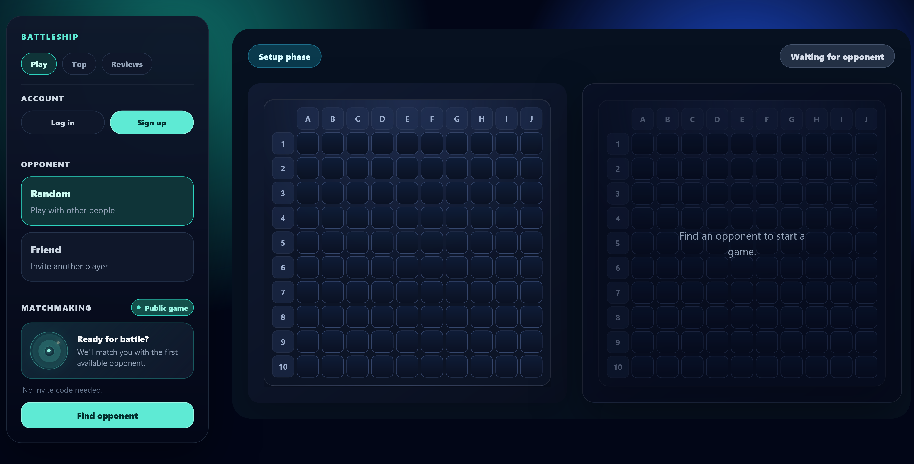
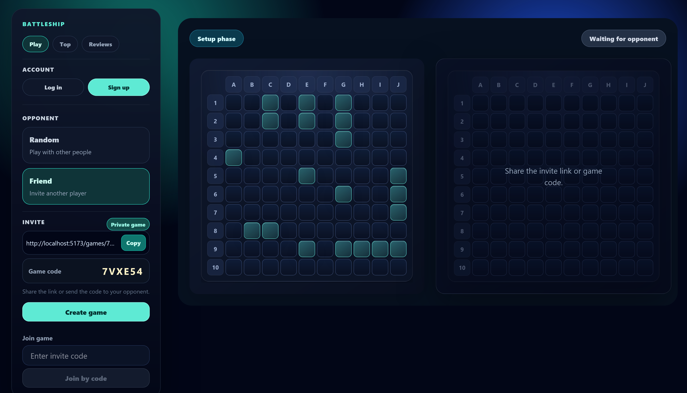
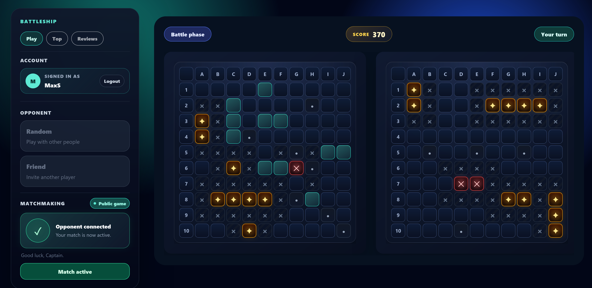
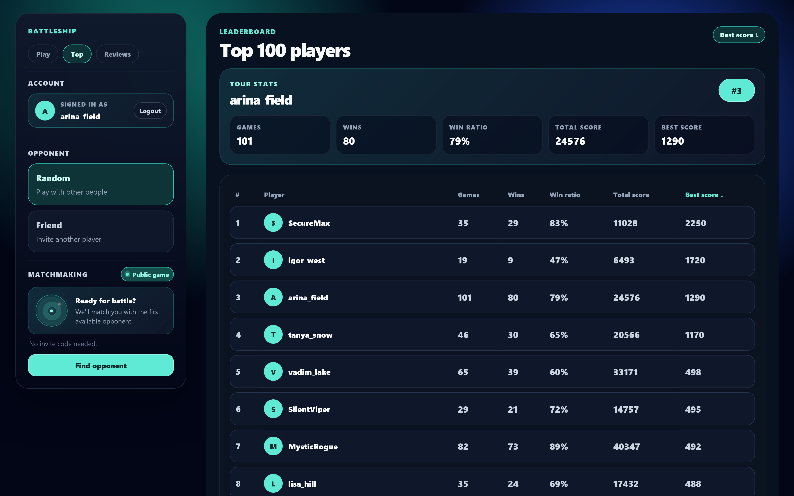

# Battleships

**Classic Battleship, rebuilt as a real-time multiplayer web game.**

Battleships is a full-stack web implementation of the classic strategy game. Players can enter
public matchmaking or create a private match, arrange their fleets, and play turn-based battles
with live opponent updates. Guest play is supported, while registered players can build persistent
statistics, compete on leaderboards, and leave ratings and reviews.

_Choose public matchmaking or create a private game with a shareable invite link._

## What Battleships offers

| Area | Included capabilities |
| --- | --- |
| **Multiplayer** | Synchronized public matchmaking and private games with shareable invite links |
| **Fleet setup** | Server-generated standard fleets with drag-and-drop placement, rotation, and collision validation |
| **Live combat** | Turn-based shooting with real-time join, readiness, move, game-over, and disconnect events |
| **Accounts** | Guest play, username/password sessions, Google OpenID Connect, and GitHub OAuth 2.0 |
| **Competition** | Streak-based scoring, personal statistics, player ranks, and sortable leaderboards |
| **Community** | Five-star ratings, rating distribution, and paginated player reviews |

_Arrange and rotate the fleet before confirming readiness for battle._

## Highlights

- Keeps the game model authoritative on the backend: ship placement, turn order, shot results,
  scores, and victory conditions are computed and enforced server-side.
- Maintains separate player views and converts untouched opponent cells to an unknown state so ship
  locations are never exposed to the other client.
- Uses a synchronized matchmaking queue to pair concurrent players safely while allowing a waiting
  player to cancel the search.
- Combines REST commands with per-player Server-Sent Event streams for opponent joins, readiness,
  battle state, shots, game completion, and disconnection notifications.
- Stores active matches in concurrent in-memory structures and persists accounts, OAuth identities,
  scores, player statistics, ratings, and comments in PostgreSQL through JPA/Hibernate.
- Supports session-based local authentication with BCrypt as well as Google and GitHub social login
  through Spring Security.
- Provides responsive React interfaces for fleet placement, combat, matchmaking, account settings,
  leaderboards, and community reviews.

_Turn-based combat with synchronized boards, live scores, and real-time opponent updates._

## How a match works

1. A player chooses a random opponent or creates a private game with a six-character invite code.
2. The backend creates an isolated game and issues an opaque UUID token for each player.
3. Both players arrange their generated fleets and confirm that they are ready.
4. When both players are ready, the server starts combat and randomly selects the first turn.
5. Every shot is resolved against server-side board state. A hit keeps the turn; a miss passes it
   to the opponent.
6. Updated board views and scores are pushed to both clients through SSE without revealing unhit
   enemy ships.
7. Destroying the final ship finishes the game; authenticated players then receive persistent score
   and match-stat updates.

## Gameplay model

| Rule | Implementation |
| --- | --- |
| **Board** | `10 × 10` grid |
| **Fleet** | One four-cell ship, two three-cell ships, three two-cell ships, and four one-cell ships |
| **Placement** | Ships cannot overlap or touch, including diagonally |
| **Turn handling** | Hits and sunk ships retain the turn; misses transfer it |
| **Opponent view** | Unhit cells and ships remain hidden; only misses, hits, sunk ships, and blocked cells are visible |
| **Scoring** | Consecutive hits increase the multiplier, sinking a ship adds a bonus, and a miss resets the streak |
| **Completion** | The match ends when one player has no ships remaining |

_Sortable player leaderboards with ranks, scores, victories, and match statistics._

## Tech stack

### Backend

- Java 17
- Spring Boot 4.0
- Spring Web MVC and REST API
- Server-Sent Events
- Spring Security
- OAuth 2.0 and OpenID Connect
- Spring Data JPA / Hibernate
- PostgreSQL
- Maven Wrapper

### Frontend

- React 19
- React Router 7
- Vite 8
- Bootstrap 5
- CSS Modules
